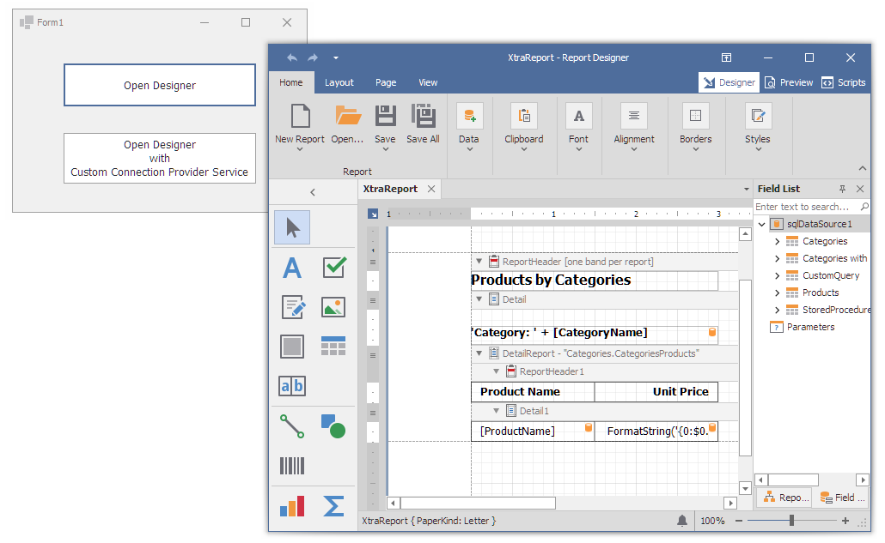

# Reporting for WinForms - How to Create a Report Bound to the SQL Data Source

This example demonstrates how to create a master-detail report in code and use the [SqlDataSource](https://docs.devexpress.com/CoreLibraries/DevExpress.DataAccess.Sql.SqlDataSource) component to bind a report to the Microsoft SQL Server database.

The project implements the [IConnectionProviderService](https://docs.devexpress.com/CoreLibraries/DevExpress.DataAccess.Wizard.Services.IConnectionProviderService) descendant that connects the data source to the local MS SQL Server if the connection name is “MyRuntimeConnection”, and creates a connection to the Microsoft SQL Server database file for any other connection name.

The service is registered for the [ReportDesignTool](https://docs.devexpress.com/XtraReports/DevExpress.XtraReports.UI.ReportDesignTool) that invokes the Report Designer.

## Files to Look At

- [Form1.cs](CS/RuntimeSqlDataSourceReportSample/Form1.cs) ([Form1.vb](VB/RuntimeSqlDataSourceReportSample/Form1.vb))
- [ReportCreator.cs](CS/RuntimeSqlDataSourceReportSample/ReportCreator.cs) ([ReportCreator.vb](VB/RuntimeSqlDataSourceReportSample/ReportCreator.vb))
- [QueryHelper.cs](CS/RuntimeSqlDataSourceReportSample/QueryHelper.cs) ([QueryHelper.vb](VB/RuntimeSqlDataSourceReportSample/QueryHelper.vb))
- [CustomConnectionProviderService.cs](CS/RuntimeSqlDataSourceReportSample/CustomConnectionProviderService.cs) ([CustomConnectionProviderService.vb](VB/RuntimeSqlDataSourceReportSample/CustomConnectionProviderService.vb))

## Documentation

- [Bind a Report to a Microsoft SQL Server Database at Runtime](https://docs.devexpress.com/XtraReports/4793/detailed-guide-to-devexpress-reporting/bind-reports-to-data/sql-database/bind-a-report-to-a-microsoft-sql-server-database-runtime-sample)
- [Use SqlDataSource](https://docs.devexpress.com/CoreLibraries/403633/devexpress-data-library/data-sources/use-the-sql-data-source)

## More Examples

- [Data Access Library - How to Create Data Sources at Runtime](https://github.com/DevExpress-Examples/how-to-create-data-access-library-data-sources-at-runtime-t424210)
- [How to Use the XRCrossTab Control to Create a Cross-Tab Report in Code](https://github.com/DevExpress-Examples/Reporting-XRCrossTab-Runtime-Sample)
- [Reporting for WinForms - Create a Report Dynamically and Bind It to a DataSet](https://github.com/DevExpress-Examples/reporting-winforms-create-report-dynamically-and-bind-it-to-dataset)